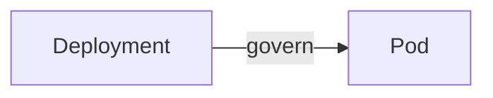

# kubectl commands


## deployment



- **apply**
```bash 
k apply -f deployment.yaml
``` 
- **get deployments** 
```bash 
k get deployments
``` 
- **get pods** 
```bash 
k get pods
```
- **logs** 
```bash 
k logs <POD_NAME>
```
- **describe pods** 
```bash 
k describe pod <POD_NAME>
```

## service


- **apply**
```bash 
k apply -f service.yaml
``` 
